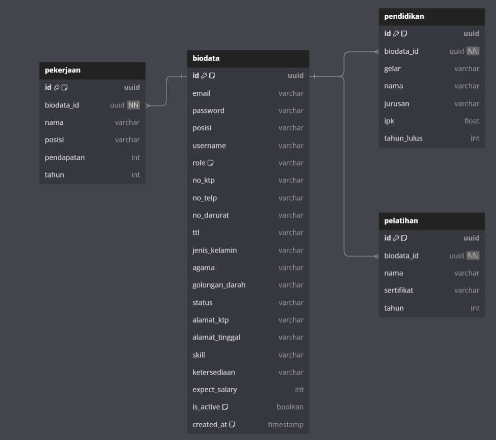

# Backend Tech Test

A brief description of what this project does and who it's for


## Run Locally

Clone the project

```bash
  git clone https://github.com/farisan/BE-EDII-TechincalTest.git
```

Go to the project directory

```bash
  cd /BE-EDII-TechincalTest
```

Install dependencies

```bash
  npm install
```

Setup ENV

```bash
  - Buat database dimanapun
  - buat folder env / masukan url database ke env jika sudah ada
  - DATABASE_URL : ....
  - JWT_SECRET : ....
  - PORT : ....
```

Start the server

```bash
  npm run dev
```


## Tech Stack

**Backend:** Node, Express, Prisma, ZOD, JWT, Bcrypt & typescript

## Database

**DB:** Postgresql & neon

Berikut adalah skema database dalam format dbDiagram.io:

```sql
Table biodata {
  id             uuid    [primary key, unique, default: `uuid()`]
  email          varchar [unique]
  password       varchar
  posisi         varchar
  username       varchar
  role           varchar [default: "karyawan"]
  no_ktp         varchar [unique]
  no_telp        varchar
  no_darurat     varchar
  ttl            varchar
  jenis_kelamin  varchar
  agama          varchar
  golongan_darah varchar
  status         varchar
  alamat_ktp     varchar
  alamat_tinggal varchar
  skill          varchar
  ketersediaan   varchar
  expect_salary  int
  is_active      boolean [default: true]
  created_at     timestamp [default: `now()`]
}

Table pendidikan {
  id          uuid    [primary key, unique, default: `uuid()`]
  biodata_id  uuid    [not null, ref: > biodata.id]
  gelar       varchar
  nama        varchar
  jurusan     varchar
  ipk         float
  tahun_lulus int
}

Table pelatihan {
  id          uuid    [primary key, unique, default: `uuid()`]
  biodata_id  uuid    [not null, ref: > biodata.id]
  nama        varchar
  sertifikat  varchar
  tahun       int
}

Table pekerjaan {
  id          uuid    [primary key, unique, default: `uuid()`]
  biodata_id  uuid    [not null, ref: > biodata.id]
  nama        varchar
  posisi      varchar
  pendapatan  int
  tahun       int
}
```
Berikut adalah gambar dari hasil relasi database:




## Related

Here are some related projects

**to:** [Frontend](https://github.com/farisan/FE-EDII-TechincalTest.git)

